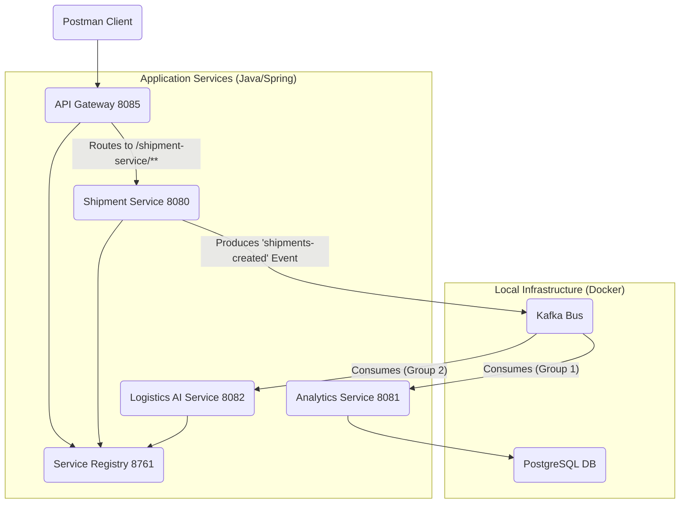

# 🚀 Quantum Logistics: AI-Driven Microservices Platform

**Quantum Logistics** is a complete, end-to-end, event-driven microservices system built to simulate a modern logistics and shipping network. This project demonstrates a cloud-native architecture using **Java, Spring Boot, Kafka, and Docker**, and serves as a blueprint for a scalable, resilient, and intelligent enterprise system.

This project was built to demonstrate core principles of distributed systems, including:

* **Service Discovery** (with Eureka)
* **Centralized Entry** (with an API Gateway)
* **Event-Driven Architecture** (with Kafka)
* **Asynchronous Processing** (fan-out pattern)
* **AI Integration** (for intelligent routing)

## 🏗️ System Architecture

This system uses a "choreography" pattern, where services communicate by producing and consuming events via a central Kafka message bus, without needing to know about each other.



### Core Services

1.  **`service-registry` (Eureka Server):**

      * The "phone book" for the system. All other microservices register themselves here, allowing them to find each other by name (e.g., `shipment-service`) instead of hard-coded ports.

2.  **`api-gateway` (Spring Cloud Gateway):**

      * The single "front door" for all public traffic. It handles request routing, security (future), and load balancing. It dynamically routes traffic (e.g., `/shipment-service/...`) by looking up the service's address in the `service-registry`.

3.  **`shipment-service` (Spring Boot):**

      * The "worker" service. It exposes the public `POST /api/shipments` endpoint.
      * Its only job is to validate the request and produce a `shipments-created` event to the Kafka bus.

4.  **`analytics-service` (Spring Boot / Kafka Consumer):**

      * A "listener" service. It subscribes to the `shipments-created` topic.
      * When it "hears" a message, it consumes it, converts it to a database entity, and saves it to the **PostgreSQL** database.

5.  **`logistics-ai-service` (Spring Boot / Spring AI):**

      * A second "listener" that demonstrates a **fan-out** pattern (one event, multiple actions).
      * It *also* subscribes to the `shipments-created` topic using a different `group-id`.
      * It takes the origin and destination, forms a prompt, and calls the **OpenAI API** to calculate an optimal shipping route, logging the result.

## 🛠️ Technology Stack

| **Category** | **Technology** | **Purpose** |
| :--------------- | :---------------------- | :---------------------------------------- |
| **Backend** | Java 17                 | Core application language                 |
| **Framework** | Spring Boot 3           | Building all 5 microservices              |
| **Service Mesh** | Spring Cloud Gateway    | API Gateway (Front Door)                  |
| **Service Mesh** | Spring Cloud Eureka     | Service Registry (Phone Book)             |
| **Events / Messaging** | Apache Kafka        | Asynchronous event bus                    |
| **Database** | PostgreSQL              | Storing shipment analytics                |
| **AI** | Spring AI (OpenAI)      | Intelligent route calculation             |
| **DevOps** | Docker / Docker Compose | Containerizing & running infrastructure   |
| **Build** | Apache Maven            | Project build and dependency management   |
| **Testing** | Postman                 | API request testing                       |

## 🏁 How to Run This Project

### 1\. Prerequisites

  * Java 17 (JDK)
  * Apache Maven 3.9+
  * Docker Desktop
  * An OpenAI API Key (for the AI service)
  * VS Code (with the Extension Pack for Java)
  * Postman

### 2\. Configuration

Before launching, you must provide your OpenAI API key.

1.  Go to `services/logistics-ai-service/src/main/resources/application.properties`.
2.  Replace the placeholder `YOUR_API_KEY_HERE` with your actual OpenAI key:
    ```properties
    spring.ai.openai.api-key=sk-YourActualKeyGoesHere...
    ```

### 3\. Local Launch Sequence (The "Idiot-Free" Order)

This system has 6 components that must be started in order. Open each of the 5 Java services in its own VS Code window.

1.  **Start the Infrastructure (Docker):**

      * Open a terminal in the project's root `quantum-logistics` folder.
      * `cd docker`
      * `docker-compose up -d`
      * *(This starts Kafka, Zookeeper, Postgres, and the Kafka-UI).*

2.  **Start the "Phone Book" (Service Registry):**

      * Open the `service-registry` project.
      * Run `ServiceRegistryApplication.java`.
      * ✅ **Verify:** Go to `http://localhost:8761/`. You should see the Eureka dashboard.

3.  **Start the "Front Door" (API Gateway):**

      * Open the `api-gateway` project.
      * Run `ApiGatewayApplication.java`.
      * ✅ **Verify:** Refresh `http://localhost:8761/`. You should see `API-GATEWAY` appear in the list.

4.  **Start the "Listeners" (Analytics & AI):**

      * Open the `analytics-service` project and run `AnalyticsServiceApplication.java`.
      * Open the `logistics-ai-service` project and run `LogisticsAiServiceApplication.java`.
      * ✅ **Verify:** Refresh `http://localhost:8761/`. You should now see `LOGISTICS-AI-SERVICE` appear.

5.  **Start the "Worker" (Shipment Service):**

      * Open the `shipment-service` project.
      * Run `ShipmentServiceApplication.java`.
      * ✅ **Verify:** Refresh `http://localhost:8761/`. All 3 services (`API-GATEWAY`, `LOGISTICS-AI-SERVICE`, `SHIPMENT-SERVICE`) should be `UP`.

The entire system is now online.

## 🚀 Testing the Full Pipeline

Use Postman to send a `POST` request to the **API Gateway** (the "Front Door"), not the service itself.

**URL:** `POST http://localhost:8085/shipment-service/api/shipments`

**Body (JSON):**

```json
{
    "origin": "Oracle HQ, Austin, TX",
    "destination": "Oracle Office, Nashville, TN",
    "customerId": "CUST-ORACLE-EVENT"
}
```

### Expected Fan-Out Result

By sending that **one request**, you will trigger three simultaneous actions:

1.  **In Postman:** You will get a `200 OK` response immediately.
2.  **In the `analytics-service` Terminal:** The log `Received shipment... CUST-ORACLE-EVENT` will appear as it saves the data to Postgres.
3.  **In the `logistics-ai-service` Terminal:** The log `AI SERVICE RECEIVED: CUST-ORACLE-EVENT` will appear, followed by an `AI RESPONSE:` with the calculated optimal route.

<!-- end list -->

```
